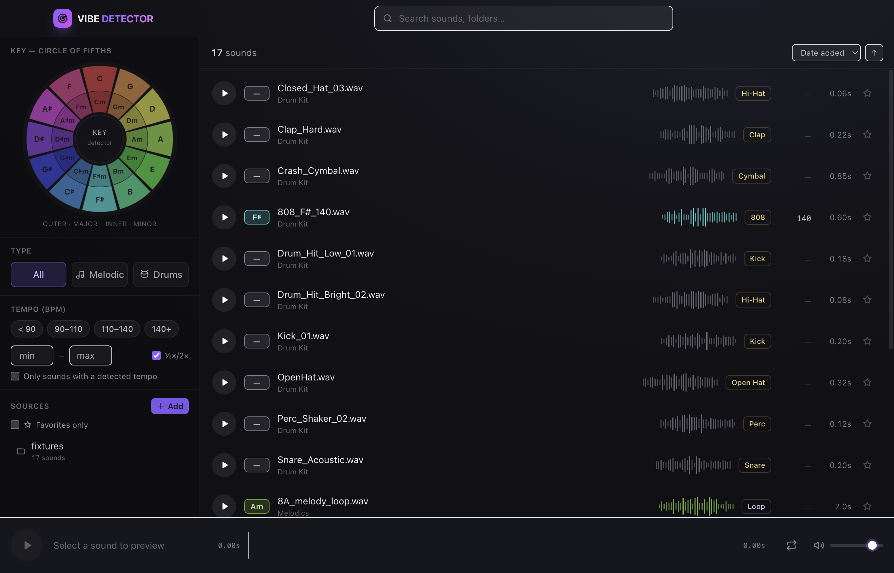

# 🛰️ Vibe Detector

**Detect the vibe of every sound.** A local-first desktop app for music producers that scans your
sample folders, figures out the **musical key**, **tempo (BPM)**, and **type** (drum one-shot vs.
melodic sample) of every sound, and lets you filter, preview, and **drag straight into your DAW** —
all offline, nothing leaves your machine.

Current release: **0.4.0**. This is the trust-and-review release: key detection is now benchmarked,
audio analysis stores structured diagnostics, rows render cached real waveform peaks, and low-confidence
or failed analysis results are easier to review and correct.



## Features

- **Folder ingestion** — add one or many sample folders; they're scanned recursively
  (`.wav .aif .aiff .flac .mp3 .ogg .m4a`) and watched for changes.
- **Key detection** — filename first (`Cmin`, `F#maj`, `Bbm`, Camelot `8A`, octave notes like `C4`,
  contextual tags like `Kick_C` / `808 F`), then embedded metadata, then pure-TypeScript audio
  analysis. Loops and chords use FFT chroma + Krumhansl–Schmuckler; tuned one-shots and drums use a
  pitch-class pass with confidence guards. Atonal/noisy material stays **Unknown**.
- **Tempo detection** — filename/metadata first (`140bpm`, `[174]`), audio autocorrelation fallback,
  with **half/double-time** matching in the filter.
- **Type & subtype classification** — drum one-shots (kick, snare, hi-hat, open hat, clap, 808, perc,
  cymbal, tom, fx) and melodic samples (loop, one-shot, stab, chord, pad, lead, pluck, bass, guitar,
  piano, synth, keys, strings, brass, winds, mallet, vocal, arp), from filename + folder + duration +
  tempo.
- **Audio-verified drums** — a worker analyzes the actual sound (pitch class, chroma, spectral
  centroid, zero-crossing rate, band energy, decay, tonality) to detect tuned drums, refine drum
  subtypes, and catch filename mislabels. It keeps the more-specific filename label within a family
  (won't flatten "Open Hat" to "Hi-Hat") and fixes cross-family errors (a "kick" that's really a hat,
  or a sustained tone mislabeled as a drum).
- **Trust and review workflow** — key badges expose source/confidence, low-confidence and unknown keys
  can be filtered, failed analysis is visible and retryable, and the detail panel records why an audio
  key candidate was accepted, rejected, updated, or cleared.
- **Key = color** — every key is mapped to a hue around the **circle of fifths**; the interactive
  wheel is both the signature visual and the key filter.
- **Fast browsing** — virtualized list, search, filter by key / type / subtype / tempo / favorites,
  review status, sort by name / key / tempo / duration / date, with cached decoded row waveforms.
- **Instant preview** — click to audition with a real waveform, scrub, loop, volume; spacebar +
  arrow keys for keyboard auditioning.
- **Drag into your DAW** — drag one or many sounds out as real files (Electron `startDrag`).
- **Edit & organize** — favorite, manually correct key/tempo/type (overrides persist across
  rescans), batch-correct selected sounds, tag, add notes, reveal in Finder.
- **Vibe Match** — selected sounds surface nearby key/tempo companions for quick layering ideas.

## Requirements

- macOS (Apple Silicon or Intel)
- Node.js 20+ (built and tested on Node 26)

## Getting started

```bash
npm install
npm run dev        # launch in development (hot reload)
```

Click **Add sample folders** (or the sidebar **Add** button) to pick folders. Vibe Detector scans
them, detects key/tempo/type, and fills the library while you browse.

### Scripts

| Script | What it does |
| --- | --- |
| `npm run dev` | Run the app with hot reload |
| `npm run build` | Production build into `out/` |
| `npm run preview` | Run the production build |
| `npm test` | Run the unit + integration test suite (Vitest) |
| `npm run typecheck` | Type-check main + renderer |
| `npm run benchmark:key` | Run the bundled key-detection benchmark |
| `npm run dist` | Build shareable macOS (universal dmg+zip) **and** Windows (zip) into `dist/` |
| `npm run dist:mac` / `npm run dist:win` | Build just one platform |

See **Sharing the app** below for distributable builds.

## Sharing the app

`npm run dist` produces installers in `dist/`:

- **macOS** — `Vibe Detector-<version>-universal.dmg` (plus a `.zip`). Universal = runs on both Apple
  Silicon and Intel Macs.
- **Windows** — `Vibe Detector-<version>-x64.zip` — unzip and run `Vibe Detector.exe`.

The builds are **unsigned** (no paid Apple/Microsoft certificate), so each OS warns on first open.
That's expected for self-distributed apps; the one-time workaround:

- **macOS (Gatekeeper):** right-click the app → **Open** → **Open**, or run
  `xattr -dr com.apple.quarantine "/Applications/Vibe Detector.app"`.
- **Windows (SmartScreen):** **More info** → **Run anyway**.

For a warning-free experience, sign + notarize with an Apple Developer ID and a Windows code-signing
certificate, then re-run `dist` (the config is signing-ready). The Windows `.exe` ships with the
default Electron file icon — the in-app window/taskbar icon is correct; embedding the `.exe` icon
requires building on Windows (or with Wine). macOS uses the full app icon.

## Marketing site

A branded, animated landing page lives in `site/` and hands the installers in `dist/` straight to
visitors:

```bash
npm run dist   # build the installers into dist/ (if you haven't already)
npm run site   # serve the marketing page at http://localhost:4178
```

`scripts/serve-site.mjs` is a zero-dependency static server that also streams the `dist/` builds at
`/downloads/<file>` (with HTTP Range support so the ~200 MB downloads are resumable) and exposes
`/api/releases` — scanned live from `dist/` — so the page always advertises the current version,
file sizes, and per-platform links. The page is built on the Vibe Detector design system
(circle-of-fifths key colors, the radar motif, Inter + JetBrains Mono): an animated radar hero, the
interactive key wheel, the detection grid, a local-first privacy panel, and OS-aware download cards.
It works fully offline (icons are inline SVG; fonts fall back to system). Set `PORT` to change the
port. Brand assets are copied into `site/assets/` from `resources/icon.png` and `docs/screenshot.png`.

## How it works

```
src/
  shared/        Pure, unit-tested logic (no Electron):
                 keyDetect · bpmDetect · classify · audioAnalysis (FFT chroma,
                 pitch-class detection, KS profiles + autocorrelation) ·
                 keyDetectionBenchmark · keyColors
  main/          Electron main process: window, vibe:// audio protocol, JSON store,
                 recursive scanner + metadata (music-metadata), chokidar watcher, drag, IPC
  preload/       Typed contextBridge API (window.api)
  renderer/      React + Tailwind UI: circle-of-fifths wheel, virtualized grid, filters,
                 wavesurfer player, detail/override panel, audio-analysis Web Worker
```

- **Detection order** (key & tempo): filename → embedded metadata → audio analysis fallback.
  Manual overrides always win and survive rescans. Weak filename keys on drums are audio-checked.
- **Audio analysis** runs for unlabeled or weak-key content, including drums: the file is decoded on
  the renderer thread (downmixed/downsampled), waveform peaks are cached, then a Web Worker computes
  the result so the UI stays responsive. Key diagnostics explain detector and store decisions.
  Decode/worker failures are stored, shown in the review queue, and can be retried.
- **Persistence** uses a pure-JS JSON store (atomic, debounced writes) behind a small repository
  interface, so a native SQLite backend can drop in later without touching callers. Your library
  (sources, detected keys/tempo/types, manual edits, cached row waveforms, audio-analysis diagnostics)
  is saved to the app's user-data folder and **reloads instantly on launch** — reopening only scans
  *new or changed* files (matched by path + size + modified-time), never re-scanning your whole
  library. The store tracks `analysisVersion` and `waveformVersion`, so improved detection or peak
  generation can re-run once without clobbering manual overrides.

## Testing

```bash
npm test
npm run benchmark:key
```

Covers filename key/BPM parsing, tuned drum/key context parsing, melodic instrument labeling,
classification, Camelot + color mapping, half/double-time matching, the FFT/Krumhansl–Schmuckler key
estimator, tuned one-shot pitch detection, noisy drum rejection, and an **integration test that scans
real generated WAV fixtures** end-to-end (`scripts/make-fixtures.mjs` writes them to `fixtures/`).

`npm run benchmark:key` runs a lightweight key-detection benchmark against embedded synthetic
filename fixtures. It reports accuracy, labeled-key coverage, precision, false-positive rate, and
miss details without requiring external sample packs or generated audio files. The reusable evaluator
lives in `src/shared/keyDetectionBenchmark.ts` for tests or future labeled fixture sets.

## Developer / demo env vars

| Variable | Purpose |
| --- | --- |
| `VIBE_DATA_DIR` | Use an isolated library directory instead of the default user-data path |
| `VIBE_IMPORT_DIR` | Comma-separated folders to auto-import on launch (no dialog) |
| `VIBE_SHOT` / `VIBE_SHOT_QUIT` | Capture the window to a PNG (via `capturePage`) and optionally quit |

Example:

```bash
node scripts/make-fixtures.mjs
VIBE_DATA_DIR=/tmp/vibe VIBE_IMPORT_DIR="$PWD/fixtures" npm run preview
```
